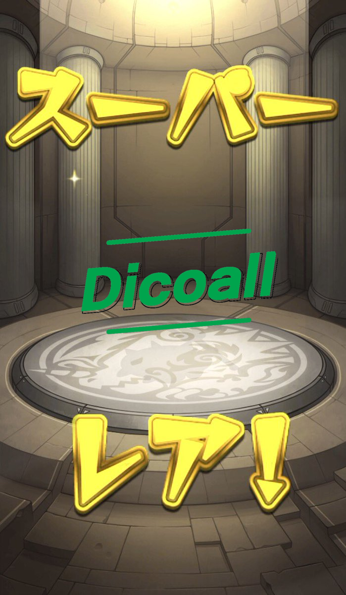

# PillowGachaCog
Pillowでモンストのガチャを生成します。

必要なもの
```
discord.py
pillow
discord.pyで作られたBot
```

まず、必要なものを用意したら、<br>
dataフォルダをmain.pyと同じ階層に作り、<br>
dataフォルダの中に、gacha.jpgを入れます。<br>
そのあとに、discord.pyで作られたBotにcog.pyを読み込ませます。<br>
そうすると、gachaコマンドが追加されます。<br>

# 生成結果

